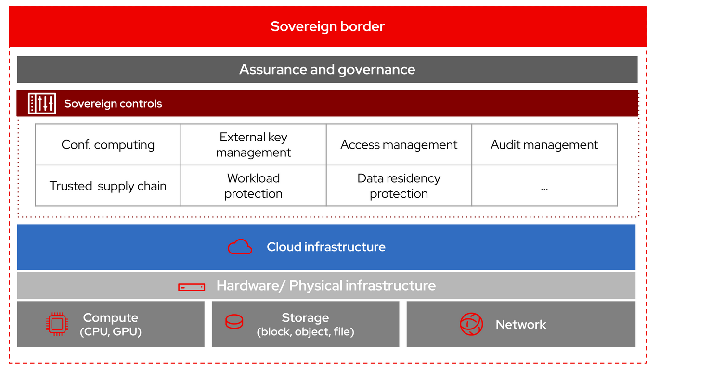

# Build a sovereign cloud
Design and deploy a sovereign cloud platform to ensure control over data location, operational independence, and compliance with local regulations.

## Detailed description

Digital sovereignty is based on the 4 pillars below:

- **Technical Sovereignty** - Running workloads without dependence on a provider’s infrastructure or software, and protected from all extra-territorial interference and scrutiny.

- **Operational sovereignty** – Visibility and control over provider operations from provisioning and performance management, to monitoring of physical and digital access, to the infrastructure. This solution leverages separation of control planes and data planes using virtualized control planes for each cluster.

- **Assurance sovereignty** – Ability to independently verify and assure the integrity, security, and reliability of digital systems and processes including resilience of critical services. This platform is highly available and resilient and allows to quickly move workloads to different locations. It also ensures integrity by creating a trusted software supply chain.

- **Data sovereignty** – Control data location and privacy to prevent unauthorized cross-border access. The platform implements this using Zero Trust security and confidential computing.

## Key features

This architecture describes and shows how to implement a platform to run workloads on heterogeneous infrastructure (on-premises, hybrid, or multi-cloud) while ensuring data remains within specific geographic and legal boundaries. It utilizes open source software to prevent vendor lock-in and implements multi-tenancy to ensure data isolation between customers and providers. The platform caters for the following use cases:

1. **Sovereign Cluster as a Service**: Allow customers to deploy their clusters establishing a strict operational and physical boundary between the platform provider and the tenants. This helps achieve technical and operational sovereignty.

2. **Sovereign Virtual Machine as a Service**: Similar to the previous point but at the virtual machine level.

3. **Observability, auditability and cost control**: Implement and automate the tools and processes required to continuously audit, monitor, and prove the compliance of the sovereign platform from build-time to runtime, as well as giving customers total visibility about their spend. This helps achieve operational sovereignty.
   
4. **Technology and operational autonomy**: Implement controls to ensure the platform is operationally autonomous, resilient, and built from trusted, verifiable software components. This helps achieve technical and assurance sovereignty.

5. **Encrypted data control**: Implement advanced cryptographic controls for tenant clusters to ensure data confidentiality at-rest, in-use, and in transit. This helps achieve data sovereignty.

## Architecture overview

The solution uses a hub-and-spoke architecture integrating the following components:

- **Management platform** – Centralized cluster running automation and GitOps to manage the lifecycle of managed platforms.

- **Managed platform** – Standard Red Hat OpenShift clusters where workloads run, utilizing virtualized worker nodes.

- **Virtual control planes** – Decoupled control planes running on dedicated VMs within the management cluster for isolation.

- **Attestation service** – Verifies that workloads run in a Trusted Execution Environment (TEE) to guarantee data in use is not visible to platform operators.

- **Identity verification service** – Provides cryptographic identity for workloads to eliminate shared secrets.

## Requirements

### Minimum hardware requirements

- **Bare metal compute nodes** – Required for worker nodes to support both VMs and containers. Major hardware providers like Dell, HP, IBM and Lenovo are certified for these deployments.

- **Trusted hardware** – Processors with solutions supporting Trusted Execution Environments (TEE) for confidential computing, like AMD SEV-SNP or Intel SGX/TDX.

### Minimum software requirements

- **Red Hat Enterprise Linux** - Operating system that is the foundation of the sovereign cloud.

- **Red Hat OpenShift Platform Plus** – Foundation for container and cluster management.

- **Red Hat Advanced Cluster Management** – For lifecycle management of clusters.

- **Red Hat OpenShift Virtualization** – To run virtual machines for control planes and legacy apps.

- **Red Hat Workload Identity Manager**, **Red Hat Build of Trustee**, **OpenShift Sandboxed Containers** – To implement zero trust and confidfential computing concepts.

- **Red Hat OpenShift GitOps** – For automated deployment and configuration management.

- **Ansible Automation Platform** - To orchestrate all the automation flows for infrastructure lifecycle management.

## Deployment

**Cluster deployment strategy** 

For a standard implementation, deploy a management cluster to act as the central hub:

1. [Deploy Red Hat Advanced Cluster Management](https://docs.redhat.com/en/documentation/red_hat_advanced_cluster_management_for_kubernetes/2.15/html/install/index) on the management cluster to govern managed clusters.

2. Implement Virtual Control Planes on the management cluster using Red Hat OpenShift Virtualization. Each managed cluster's control plane should run on its own dedicated virtual machine to isolate it from the data plane.

3. Deploy worker nodes on bare metal in the managed clusters to host the actual application workloads.

4. Create a User Defined Network (UDN) per managed cluster to ensure network separation. 

In the case of disconnected environments, this is how to deploy the management cluster:

1. Establish a landing zone (low trust zone) with a bastion host.

2. Configure the bastion host with Red Hat Enterprise Linux and Ansible Core.

3. Use Ansible playbooks to mirror repositories from Red Hat Quay and bootstrap the management cluster deployment into the high trust zone.

**Zero Trust concepts implementation**

1. Install and configure Red Hat Build of Trustee operator.
2. Install and configure Red Hat OpenSHift Sandboxed Containers opeerator.
3. Install Workload Identity Manager.
4. Deploy Red Hat Trusted Software Supply Chain.

