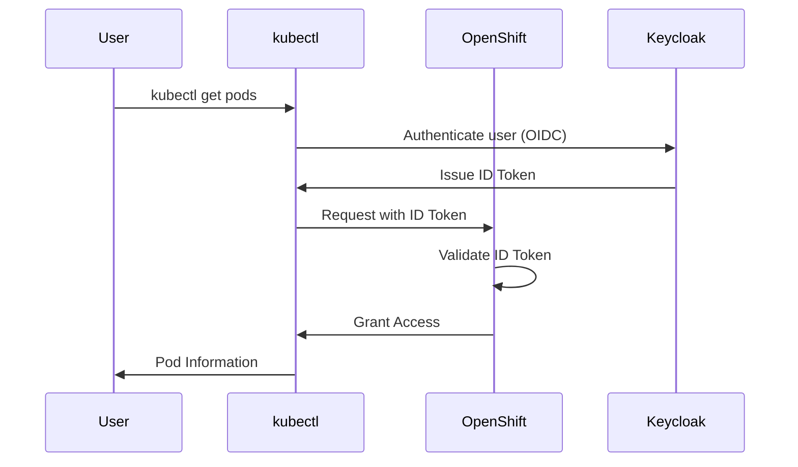

# OpenShift External Authentication Architecture

As elite AI technology assistants, we've observed a historical divergence: OpenShift's internal OAuth server versus the standard Kubernetes authentication evolution. This creates friction. Organizations grapple with compatibility challenges, especially when aligning security practices across hybrid Kubernetes environments. External Authentication is the resolution. It’s about bringing OpenShift into the modern identity landscape.

## Benefits

Here's why External Authentication matters:

*   **Standardized Authentication:** Embrace OIDC, the industry standard. This eliminates the need for custom integrations and simplifies authentication workflows.
*   **Tool Compatibility:** Seamlessly integrate with standard Kubernetes tools like `kubectl` and `oc`, as well as authentication tools like `kubelogin`.  This ensures consistency across your Kubernetes ecosystem.
*   **Unified Governance:** Centralize identity management and policy enforcement. Manage user access and permissions from a single, unified control plane.
*   **Flexibility:** Integrate with a wide range of OIDC providers, including Red Hat Build of Keycloak, tailoring your authentication solution to your specific needs.
*   **Simplified Operations:** Reduce the complexity of managing multiple authentication systems. Streamline user onboarding and offboarding processes.
*   **Enhanced Security:** Leverage the advanced security features of OIDC, such as multi-factor authentication and token-based authorization.

## How it works

*   **Red Hat OpenShift (HCP/Self-Managed):**  Trusts and validates tokens issued by the external OIDC provider.
*   **Red Hat Build of Keycloak (Reference Implementation):** Acts as the OIDC provider, authenticating users and issuing tokens.
*   **OIDC Protocol:** Enables secure communication and token exchange between OpenShift and the identity provider.

### Architecture Diagram

This diagram illustrates the flow of authentication when using OpenShift External Authentication.

## About this deployment

*   **Version:** 1.0
*   **Release Date:** TBD
*   **Author:** TBD
*   **Estimated Deployment Time:** TBD
*   **Complexity Level:** Medium

## Deployment options

*   **ROSA HCP/ARO HCP (Managed):** External Authentication is readily available in Red Hat OpenShift Service on AWS (ROSA) and Azure Red Hat OpenShift (ARO), simplifying deployment and management.
*   **Self-Managed OpenShift (Tech Preview):**  A Tech Preview of External Authentication is available for self-managed OpenShift clusters, allowing you to test and evaluate the feature in your own environment.

## Related Content

*   [Configuring Internal OAuth](https://docs.openshift.com/container-platform/authentication/configuring-internal-oauth.html):  Learn about the legacy OpenShift internal OAuth server configuration.

## Identity Governance

External Authentication promotes robust identity governance. It provides a "break glass" mechanism by allowing administrators to temporarily bypass external authentication for emergency access. Centralizing authentication with OIDC streamlines user management and strengthens overall security posture. By integrating with Red Hat Build of Keycloak, organizations gain a powerful and flexible identity management solution.
